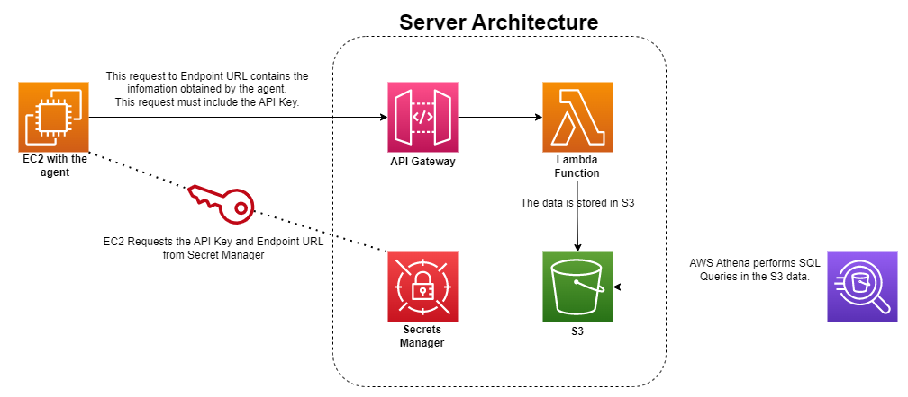

# Endpoint Metrics
Endpoint Metrics is a program designed to collect information from a machine, such as processor, running processes, logged-in users, etc., and send this information to an API.

The API is built completely serverless using AWS services, such as API Gateway, Lambda, Secret Manager, and S3 Bucket.

# Architecture
To receive logs from all sources that use the Endpoint Metrics agent, a completely serverless architecture is used, making the solution completely scalable for robust environments and also cost-effective to maintain and use.

Below is a diagram of how the metrics leave the agent and are stored:

The flow of logs is as follows:
 - The logs are initially obtained by the agent, which must be installed on an EC2 machine.
 - Then, it obtains the access credentials to the API Gateway as URI and API_KEY, both stored in the Secret Manager.
 - The logs are sent to the API Gateway.
 - After being received by the API Gateway, if the API_KEY is correct, the data is sent to Lambda.
 - Lambda processes the received data, validates and converts it to the appropriate format, and stores it in the S3 Bucket in JSON files.
 - With the data stored in the S3 Bucket, it's possible to use AWS Athena to perform SQL queries to obtain recent machine information as well as old data for investigation purposes.

# Installation

## Server
To set up the server structure, simply use the [API Server Cloudformation Template](cloudformation/server-stack.json) and import it into AWS Cloudformation service. It will create all the necessary serverless infrastructure.

## Client
To collect data and send it to the API, you need to install the agent on your EC2 machine using the [installation script](client/install-instance-metrics.sh) on a debian-based machine. In others operating systems, you'll need to manually schedule the [Client](client/client.py) Python program to run periodically.

In order to Agent client work will also need to grant permissions to EC2 instance Role to perform `secretsmanager:GetSecretValue` on resources `arn:aws:secretsmanager:*:*:secret:INSTANCE_METRICS_URL*` and `arn:aws:secretsmanager:*:*:secret:INSTANCE_METRICS_APIKEYSECRET*`.

To facilitate testing, you can use the Cloudformation Template to automatically create an AWS EC2 Debian that installs the agent on the machine through the UserData initialization script. To test, simply import the [Client template](cloudformation/client-stack.json) as many times as you want to create a testing environment for the agent.

# Possible improvements:
 - The Server API Gateway could have a dedicated endpoint to send queries to Athena and return the queried data.
 - It would be possible to create Client Agent Packages to distribute it to all instances in AWS organization through AWS SSM.
 - The S3 Bucket that stores the collected data could be configured with a LifeCycle policy.
